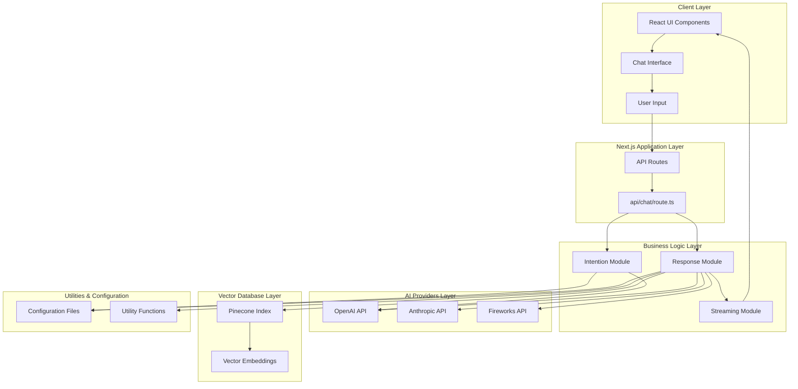
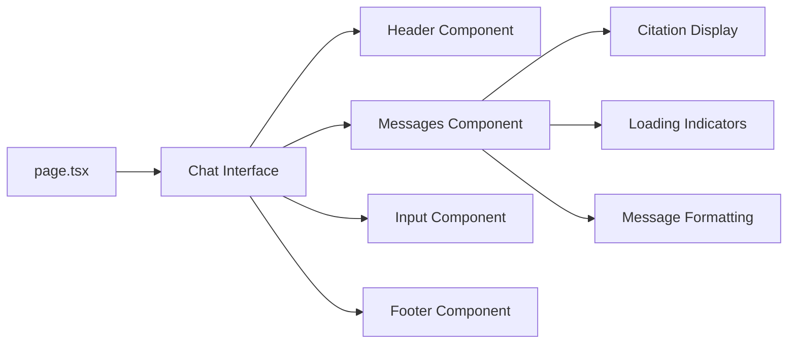
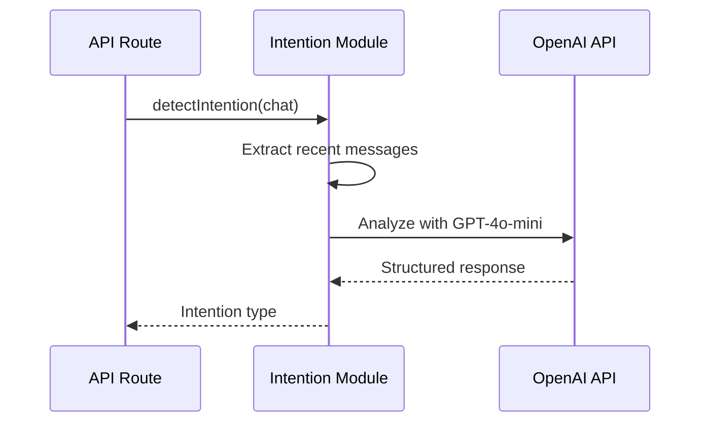
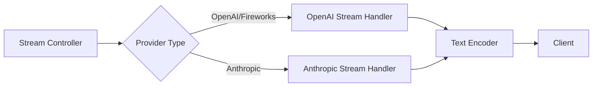
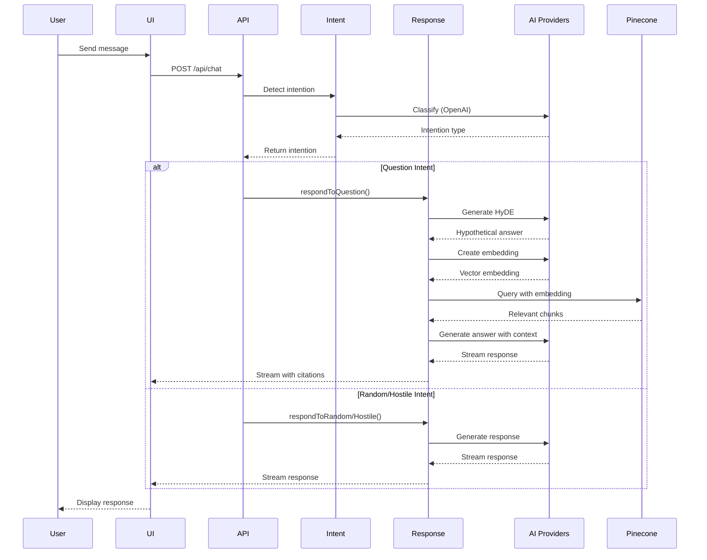
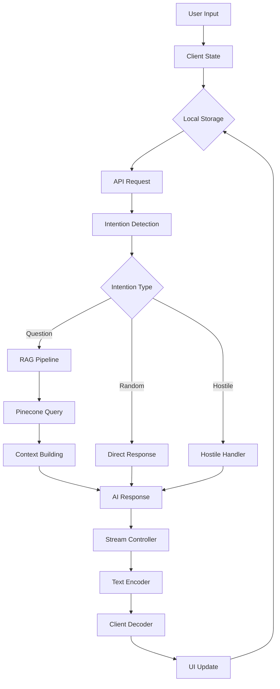
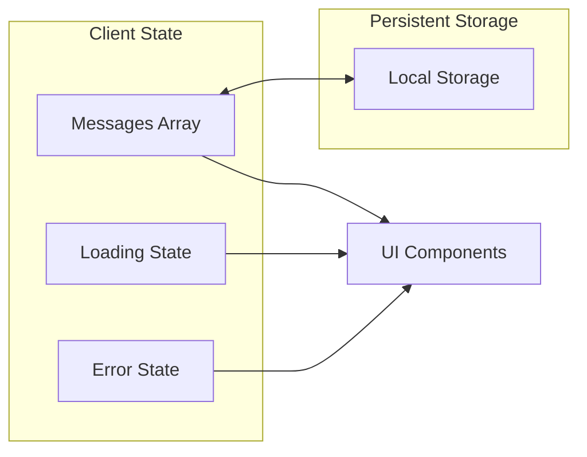
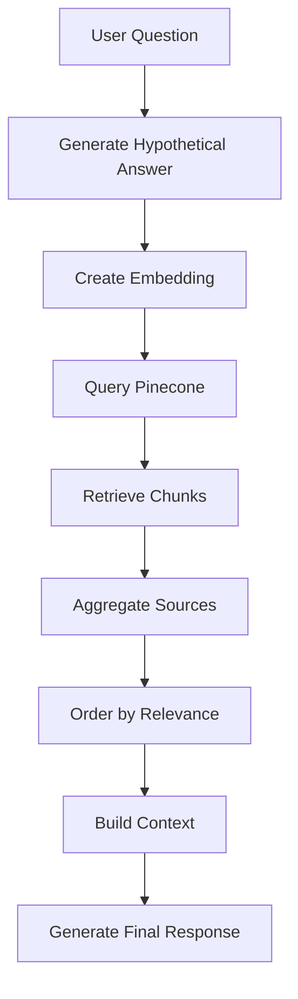
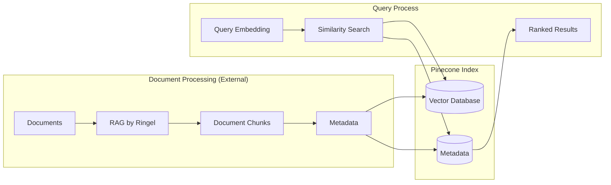
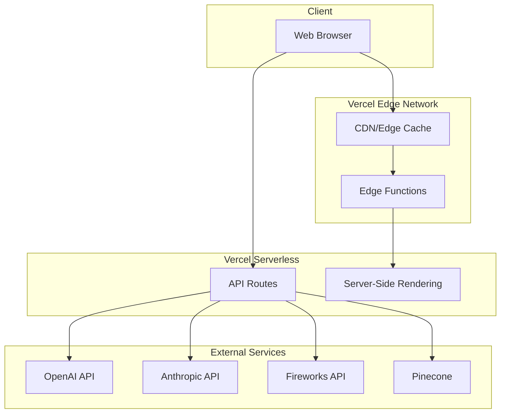

# Architecture Documentation

## Table of Contents

- [Overview](#overview)
- [System Architecture](#system-architecture)
- [Core Components](#core-components)
- [AI Integration Flow](#ai-integration-flow)
- [Data Flow](#data-flow)
- [RAG (Retrieval-Augmented Generation) Pipeline](#rag-retrieval-augmented-generation-pipeline)
- [Technology Stack](#technology-stack)
- [Directory Structure](#directory-structure)
- [Key Modules](#key-modules)
- [Configuration System](#configuration-system)
- [Deployment Architecture](#deployment-architecture)

---

## Overview

This AI chatbot is a sophisticated conversational system built on Next.js that leverages multiple AI providers (OpenAI, Fireworks AI, and Anthropic AI) to deliver intelligent responses. The system uses RAG (Retrieval-Augmented Generation) with Pinecone vector database to provide contextually accurate answers based on custom document knowledge.

### Key Architectural Principles

1. **Modular Design**: Separation of concerns with distinct modules for intention detection, response generation, and streaming
2. **Multi-Provider Support**: Flexible AI provider integration supporting OpenAI, Anthropic, and Fireworks
3. **RAG Integration**: Vector-based document retrieval for enhanced context awareness
4. **Streaming Responses**: Real-time response delivery for improved user experience
5. **Configuration-Driven**: Easy customization through configuration files

---

## System Architecture



---

## Core Components

### 1. Frontend Layer (`/app` & `/components`)



**Components:**
- **page.tsx**: Main application entry point
- **chat/header.tsx**: Chat header with branding
- **chat/messages.tsx**: Message display with streaming support
- **chat/input.tsx**: User input handling
- **chat/citation.tsx**: Source citation display
- **chat/loading.tsx**: Loading state indicators
- **chat/formatting.tsx**: Message content formatting (markdown, code, LaTeX)

### 2. API Layer (`/app/api/chat`)

**route.ts** - Main API endpoint that:
1. Receives chat messages from the client
2. Determines user intention
3. Routes to appropriate response handler
4. Streams responses back to client

```plaintext
POST /api/chat
├── Intention Detection
├── Response Generation
│   ├── Question Response (with RAG)
│   ├── Random Message Response
│   └── Hostile Message Response
└── Stream Response to Client
```

### 3. Business Logic Layer (`/modules`)

#### Intention Module (`modules/intention.ts`)

Analyzes user messages to classify intent into:
- **question**: Requires knowledge retrieval
- **hostile_message**: Inappropriate content
- **random**: General conversation



#### Response Module (`modules/response.ts`)

Generates responses based on detected intention:

**Question Response Flow:**
1. Generate hypothetical answer (HyDE technique)
2. Create embedding from hypothetical answer
3. Query Pinecone for relevant documents
4. Build context from retrieved chunks
5. Stream AI response with citations

**Random/Hostile Response Flow:**
1. Select appropriate system prompt
2. Stream AI response directly

### 4. Streaming Layer (`/actions/streaming.ts`)

Handles real-time response streaming from AI providers:



**Key Functions:**
- `handleOpenAIStream()`: Streams from OpenAI and Fireworks
- `handleAnthropicStream()`: Streams from Anthropic
- `queueIndicator()`: Sends loading status updates
- `queueError()`: Handles error states

---

## AI Integration Flow



---

## Data Flow

### Message Flow



### State Management



---

## RAG (Retrieval-Augmented Generation) Pipeline

### HyDE (Hypothetical Document Embeddings) Technique

The system uses an advanced RAG approach with HyDE:



### RAG Pipeline Steps

1. **Hypothetical Answer Generation** (`utilities/chat.ts: generateHypotheticalData()`)
   - Uses GPT-4o-mini to generate what an ideal answer might look like
   - This helps find semantically similar documents

2. **Embedding Creation** (`utilities/chat.ts: embedHypotheticalData()`)
   - Converts hypothetical answer to vector embedding
   - Uses OpenAI's `text-embedding-ada-002` model

3. **Vector Search** (`utilities/chat.ts: searchForChunksUsingEmbedding()`)
   - Queries Pinecone index with embedding
   - Retrieves top-k most relevant chunks (default: 7)

4. **Source Aggregation** (`utilities/chat.ts: getSourcesFromChunks()`)
   - Groups chunks by source document
   - Sorts chunks within each source by order

5. **Context Building** (`utilities/chat.ts: getContextFromSources()`)
   - Constructs context string with citations
   - Includes pre/post context for continuity

6. **Response Generation** (`modules/response.ts: respondToQuestion()`)
   - Sends context and user question to AI
   - Streams response with inline citations

### Pinecone Integration



**Metadata Structure:**
```typescript
{
  text: string              // Main chunk content
  pre_context: string       // Text before chunk
  post_context: string      // Text after chunk
  source_url: string        // Source identifier
  source_description: string // Human-readable source name
  order: number             // Chunk position in document
}
```

---

## Technology Stack

### Frontend
- **Next.js 14**: React framework with App Router
- **React 18**: UI library with hooks
- **Tailwind CSS**: Utility-first styling
- **Framer Motion**: Animations
- **Radix UI**: Accessible component primitives
- **shadcn/ui**: Pre-built component library

### Backend
- **Next.js API Routes**: Serverless functions
- **TypeScript**: Type-safe development

### AI & ML
- **OpenAI API**: GPT-4o, GPT-4o-mini
- **Anthropic API**: Claude models
- **Fireworks AI**: Alternative LLM provider
- **OpenAI Embeddings**: text-embedding-ada-002

### Vector Database
- **Pinecone**: Managed vector database for RAG

### Development Tools
- **ESLint**: Code linting
- **Prettier**: Code formatting
- **TypeScript**: Static typing

---

## Directory Structure

```
myAI/
├── app/                          # Next.js app directory
│   ├── api/
│   │   └── chat/
│   │       └── route.ts         # Main chat API endpoint
│   ├── parts/
│   │   └── error/               # Error handling components
│   ├── layout.tsx               # Root layout
│   ├── page.tsx                 # Main chat page
│   └── terms/                   # Terms page
│
├── components/                   # React components
│   ├── chat/                    # Chat-specific components
│   │   ├── citation.tsx         # Citation display
│   │   ├── footer.tsx           # Chat footer
│   │   ├── formatting.tsx       # Message formatting
│   │   ├── header.tsx           # Chat header
│   │   ├── input.tsx            # Message input
│   │   ├── loading.tsx          # Loading states
│   │   └── messages.tsx         # Message list
│   ├── ui/                      # Reusable UI components (shadcn)
│   └── ThemeToggle.tsx          # Dark/light mode toggle
│
├── configuration/                # Configuration files
│   ├── chat.ts                  # Chat settings
│   ├── identity.ts              # Bot identity config
│   ├── models.ts                # AI model settings
│   ├── pinecone.ts              # Pinecone configuration
│   ├── prompts.ts               # System prompts
│   └── ui.ts                    # UI text configuration
│
├── modules/                      # Business logic modules
│   ├── intention.ts             # Intention detection
│   └── response.ts              # Response generation
│
├── actions/                      # Server actions
│   └── streaming.ts             # Streaming utilities
│
├── utilities/                    # Utility functions
│   ├── chat.ts                  # Chat utilities (RAG pipeline)
│   ├── chatProcessing.js        # Message processing
│   ├── chatUtils.js             # Chat helpers
│   └── formatting.tsx           # Text formatting
│
├── types/                        # TypeScript type definitions
│   ├── ai.ts                    # AI provider types
│   ├── chat.ts                  # Chat types
│   ├── data.ts                  # Data structure types
│   ├── streaming.ts             # Streaming types
│   └── index.ts                 # Type exports
│
├── lib/                          # Library code
├── hooks/                        # React hooks
├── public/                       # Static assets
├── scripts/                      # Build/deployment scripts
├── __tests__/                    # Test files
│
├── .env                          # Environment variables
├── .env.template                 # Environment template
├── next.config.mjs               # Next.js configuration
├── tailwind.config.ts            # Tailwind configuration
├── tsconfig.json                 # TypeScript configuration
└── package.json                  # Dependencies
```

---

## Key Modules

### 1. Intention Detection (`modules/intention.ts`)

**Purpose**: Classify user intent to route messages appropriately

**Process:**
```plaintext
detectIntention(chat) -> Intention
├── Extract recent message history
├── Send to OpenAI with INTENTION_PROMPT
└── Return structured intention type
```

**Configuration:**
- Model: `INTENTION_MODEL` (default: gpt-4o-mini)
- Temperature: `INTENTION_TEMPERATURE` (default: 0.7)
- Context: `HISTORY_CONTEXT_LENGTH` messages

### 2. Response Generation (`modules/response.ts`)

**Purpose**: Generate appropriate responses based on intention

**Three Response Types:**

#### A. Question Response (RAG-enabled)
```plaintext
respondToQuestion(chat, providers, pineconeIndex)
├── Generate hypothetical answer (HyDE)
├── Create embedding
├── Query Pinecone
├── Build context from chunks
├── Generate response with context
└── Stream with citations
```

#### B. Random Message Response
```plaintext
respondToRandomMessage(chat, providers)
├── Use RANDOM_RESPONSE system prompt
├── Include recent message history
└── Stream response
```

#### C. Hostile Message Response
```plaintext
respondToHostileMessage(chat, providers)
├── Use HOSTILE_RESPONSE system prompt
├── No message history (fresh response)
└── Stream polite decline
```

### 3. Streaming Handler (`actions/streaming.ts`)

**Purpose**: Stream AI responses in real-time

**Supported Providers:**
- **OpenAI/Fireworks**: Uses OpenAI SDK streaming
- **Anthropic**: Uses Anthropic SDK streaming

**Stream Events:**
```typescript
type StreamedMessage =
  | { type: "loading", indicator: {...} }
  | { type: "message", message: {...} }
  | { type: "error", indicator: {...} }
  | { type: "done", final_message: string }
```

### 4. Chat Utilities (`utilities/chat.ts`)

**Purpose**: RAG pipeline implementation

**Key Functions:**

| Function | Purpose |
|----------|---------|
| `generateHypotheticalData()` | Create hypothetical answer using HyDE |
| `embedHypotheticalData()` | Convert text to vector embedding |
| `searchForChunksUsingEmbedding()` | Query Pinecone for relevant chunks |
| `getSourcesFromChunks()` | Aggregate and order chunks by source |
| `getContextFromSources()` | Build formatted context string |
| `getCitationsFromChunks()` | Extract citation metadata |
| `buildPromptFromContext()` | Construct system prompt with context |

---

## Configuration System

The chatbot is highly customizable through configuration files:

### Configuration Files

#### 1. `configuration/identity.ts`
```typescript
export const OWNER_NAME: string
export const OWNER_DESCRIPTION: string
export const AI_NAME: string
export const AI_TONE: string
export const AI_ROLE: string
```

#### 2. `configuration/models.ts`
```typescript
// Model selection for each task
INTENTION_MODEL: "gpt-4o-mini"
RANDOM_RESPONSE_PROVIDER: "openai"
RANDOM_RESPONSE_MODEL: "gpt-4o-mini"
HOSTILE_RESPONSE_PROVIDER: "openai"
HOSTILE_RESPONSE_MODEL: "gpt-4o-mini"
QUESTION_RESPONSE_PROVIDER: "openai"
QUESTION_RESPONSE_MODEL: "gpt-4o"
HYDE_MODEL: "gpt-4o-mini"

// Temperature settings
INTENTION_TEMPERATURE: 0.7
RANDOM_RESPONSE_TEMPERATURE: 0.7
HOSTILE_RESPONSE_TEMPERATURE: 0.7
QUESTION_RESPONSE_TEMPERATURE: 0.7
HYDE_TEMPERATURE: 0.7
```

#### 3. `configuration/pinecone.ts`
```typescript
PINECONE_INDEX_NAME: "my-ai"
QUESTION_RESPONSE_TOP_K: 7
```

#### 4. `configuration/ui.ts`
```typescript
// UI text customization
CHAT_HEADER: string
MESSAGE_PLACEHOLDER: string
FOOTER_MESSAGE: string
CLEAR_BUTTON_TEXT: string
PAGE_TITLE: string
PAGE_DESCRIPTION: string
EMPTY_CITATION_MESSAGE: string
```

#### 5. `configuration/prompts.ts`
System prompts for:
- Intention detection
- Question responses
- Random message responses
- Hostile message responses
- HyDE generation

### Environment Variables

```bash
# Required API Keys
OPENAI_API_KEY=sk-...           # OpenAI API access
ANTHROPIC_API_KEY=sk-ant-...    # Anthropic API access
FIREWORKS_API_KEY=...           # Fireworks AI access
PINECONE_API_KEY=...            # Pinecone database access
```

---

## Deployment Architecture

### Vercel Deployment



### Deployment Features

1. **Edge-Optimized**: Static assets served from edge locations
2. **Serverless Functions**: API routes scale automatically
3. **Environment Variables**: Secure secret management
4. **Continuous Deployment**: Auto-deploy from Git
5. **Preview Deployments**: Branch-based previews

### Performance Optimizations

1. **Streaming Responses**: Reduces perceived latency
2. **Local Storage**: Persists chat history client-side
3. **Lazy Loading**: Components loaded on demand
4. **Code Splitting**: Optimized bundle sizes
5. **Edge Caching**: Static content cached globally

---

## API Integration Details

### OpenAI Integration

**Used For:**
- Intention detection (GPT-4o-mini)
- Hypothetical answer generation (GPT-4o-mini)
- Text embeddings (text-embedding-ada-002)
- Final responses (GPT-4o)

**Implementation:**
```typescript
const openaiClient = new OpenAI({
  apiKey: process.env.OPENAI_API_KEY,
})
```

### Fireworks AI Integration

**Used For:**
- Alternative LLM provider
- Compatible with OpenAI SDK

**Implementation:**
```typescript
const fireworksClient = new OpenAI({
  baseURL: "https://api.fireworks.ai/inference/v1",
  apiKey: process.env.FIREWORKS_API_KEY,
})
```

### Anthropic Integration

**Used For:**
- Alternative LLM provider (Claude models)

**Implementation:**
```typescript
const anthropicClient = new Anthropic({
  apiKey: process.env.ANTHROPIC_API_KEY,
})
```

### Pinecone Integration

**Used For:**
- Vector storage and similarity search

**Implementation:**
```typescript
const pineconeClient = new Pinecone({
  apiKey: process.env.PINECONE_API_KEY,
})
const pineconeIndex = pineconeClient.Index(PINECONE_INDEX_NAME)
```

---

## Future Enhancements

Potential architectural improvements:

1. **Caching Layer**: Redis for frequently asked questions
2. **Analytics**: Usage tracking and monitoring
3. **Multi-Language Support**: i18n integration
4. **Voice Interface**: Speech-to-text/text-to-speech
5. **Advanced RAG**: Hybrid search (keyword + semantic)
6. **Fine-Tuning**: Custom model training
7. **Multi-Modal**: Image understanding and generation
8. **WebSocket**: Alternative to SSE for real-time streaming

---

## Troubleshooting Guide

### Common Issues

#### 1. API Key Errors
**Symptom**: "OPENAI_API_KEY is not set" or similar
**Solution**: Ensure `.env` file contains all required keys

#### 2. Pinecone Connection Errors
**Symptom**: "Error searching for chunks"
**Solution**:
- Verify `PINECONE_INDEX_NAME` matches actual index
- Check Pinecone API key validity
- Ensure index has documents uploaded

#### 3. Streaming Issues
**Symptom**: Responses not appearing in real-time
**Solution**:
- Check network connection
- Verify stream decoding in client
- Check browser console for errors

#### 4. Citation Not Displaying
**Symptom**: No source citations shown
**Solution**:
- Verify Pinecone has metadata
- Check `source_url` and `source_description` fields
- Ensure chunks have valid metadata

---

## Security Considerations

1. **API Keys**: Never commit `.env` to version control
2. **Rate Limiting**: Implement on production deployments
3. **Input Validation**: Sanitize user inputs
4. **CORS**: Properly configured for production domain
5. **Environment Isolation**: Separate dev/staging/prod keys

---

## Performance Metrics

Typical response times:
- **Intention Detection**: 200-500ms
- **Embedding Generation**: 100-300ms
- **Pinecone Query**: 50-200ms
- **Response Streaming Start**: 500-1000ms
- **Full Response**: 2-5s (varies with length)

---

## Additional Resources

- [Next.js Documentation](https://nextjs.org/docs)
- [OpenAI API Reference](https://platform.openai.com/docs)
- [Anthropic API Reference](https://docs.anthropic.com)
- [Pinecone Documentation](https://docs.pinecone.io)
- [RAG by Ringel](https://rag.ringel.ai/)

---

**Last Updated**: 2025-10-08

**Maintained By**: David (Son) Nguyen

**License**: MIT
